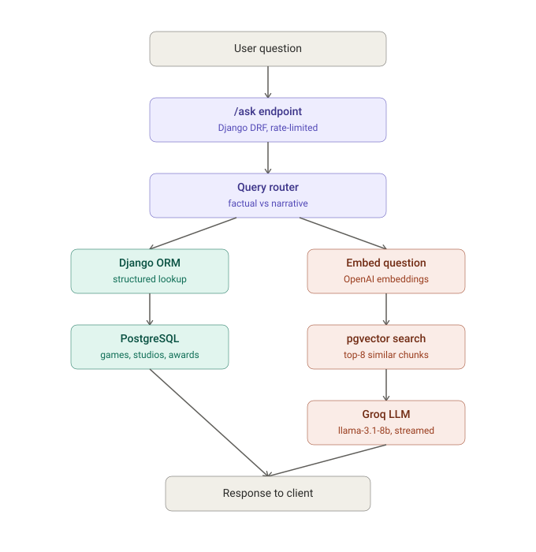

# gamelore-rag

> A RAG system for deep narrative analysis of story-driven games — hybrid structured + vector retrieval, built on Django, DRF, pgvector, and LangChain. **Live at [gamelore-rag.fly.dev](https://gamelore-rag.fly.dev)**

## Stack

- Django + DRF
- PostgreSQL + pgvector (custom-compiled image on Fly.io)
- LangChain + OpenAI (embeddings) + Groq (LLM)
- Celery + Redis (async ingestion)
- JWT auth (djangorestframework-simplejwt) + DRF rate limiting
- drf-spectacular (Swagger/OpenAPI docs)
- Docker → Fly.io

## Status

✅ Deployed and live — core RAG loop, streaming, eval harness, auth, rate limiting, and API docs all shipped to production.

## Live links

- **API:** https://gamelore-rag.fly.dev/api/v1/
- **Swagger docs:** https://gamelore-rag.fly.dev/api/schema/swagger-ui/
- **Health check:** https://gamelore-rag.fly.dev/api/v1/health/

## What this is

A hybrid retrieval system that answers two kinds of questions about story-driven games:

- **Factual questions** ("Who developed Expedition 33?") → routed to PostgreSQL via Django ORM
- **Narrative questions** ("What does the Maelle ending represent?") → routed to pgvector semantic search → LLM synthesis with citations, streamed token-by-token

A keyword router classifies incoming questions and sends them down the correct path — no wasted LLM calls on questions the database can already answer.

## Try it

```bash
curl -X POST https://gamelore-rag.fly.dev/api/v1/ask/ \
  -H "Content-Type: application/json" \
  -d '{"question": "who made Expedition 33"}'
```

```bash
curl -X POST https://gamelore-rag.fly.dev/api/v1/ask/ \
  -H "Content-Type: application/json" \
  -d '{"question": "what is the narrative theme of Expedition 33"}'
```

## Corpus

Full multi-source ingestion (Wikipedia + developer interview transcripts):

- Clair Obscur: Expedition 33
- The Last of Us
- God of War (2018) / God of War Ragnarok

12 games loaded structurally via IGDB; corpus expansion (Red Dead Redemption 2, Uncharted, Beyond: Two Souls) is a documented next step. Narrative questions about games outside the fully-ingested corpus currently fall back to the LLM's general knowledge rather than refusing — a known limitation flagged during edge-case testing, see "What's next."

## Eval Harness

20 hand-written domain-expert questions with known-good answers (14 currently active against the fully-ingested corpus, 6 held as a corpus-expansion backlog). Retrieval precision measured via keyword overlap between retrieved chunks and expected answers — used to tune retrieval parameters before deploying.

**Top-k tuning results:**

| top-k | retrieval score | gain vs previous |
|---|---|---|
| 3 | 0.38 | — |
| 5 | 0.45 | +0.07 |
| 8 | 0.50 | +0.05 |
| 12 | 0.55 | +0.05 |
| 15 | 0.56 | +0.01 |

**Decision:** k=8 selected for production. Captures the majority of retrieval gain while avoiding the token cost and context dilution of retrieving 12-15 chunks per query for marginal improvement.

**Chunk size tuning results:**

| chunk size | retrieval score |
|---|---|
| 256 | 0.40 |
| 512 | 0.49 |
| 1024 | 0.59 |

**Decision:** chunk_size=1024 selected. Larger chunks carry more surrounding context per embedding, which matters for this corpus since sources are long-form (Wikipedia articles, full interview transcripts) rather than short, discrete facts — more context per chunk means each embedding is more likely to contain the keywords needed to answer a question correctly.

## Architecture



Async ingestion runs through Celery + Redis, decoupled from the query API — fetching, chunking, and embedding new sources never blocks `/ask`.

## Key technical decisions

- **pgvector on classic Fly Postgres, not Managed Postgres** — Fly's Managed Postgres has pgvector as a toggle but starts at $38/month with no free tier. Built a custom Docker image (`flyio/postgres-flex` + compiled pgvector v0.7.4) deployed as classic Fly Postgres instead — full pgvector support at a fraction of the cost.
- **JWT auth available, `/ask` left public** — `/ask` is intentionally unauthenticated so reviewers can hit the live demo without credentials. JWT infrastructure (`djangorestframework-simplejwt`) is fully wired and functional (`/api/v1/token/`) as a demonstration of the pattern; DRF rate limiting is the actual abuse protection on the public endpoint.
- **Groq for generation, OpenAI for embeddings only** — Groq's free tier handles all LLM calls; OpenAI is used exclusively for embeddings (~$1 total cost for the entire corpus), keeping the project effectively free to run.

## Tests

14 pytest tests covering the router, retrieval, `/ask` endpoint (LLM and embeddings mocked), and edge cases.

## Run locally

```bash
git clone https://github.com/TigerCDev/gamelore-rag.git
cd gamelore-rag
docker compose up --build
```

## What's next

- Corpus expansion to remaining catalog (RDR2, Uncharted, Beyond: Two Souls)
- Tighten narrative-path prompt to refuse rather than fall back to general knowledge when retrieval returns no relevant chunks
